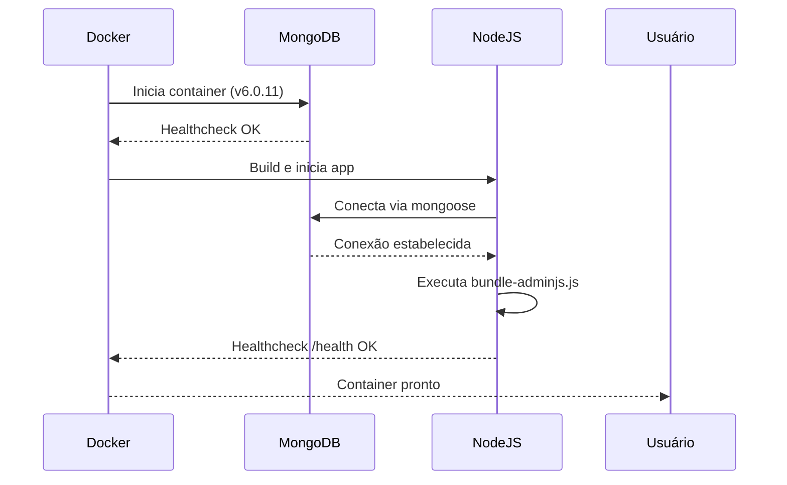
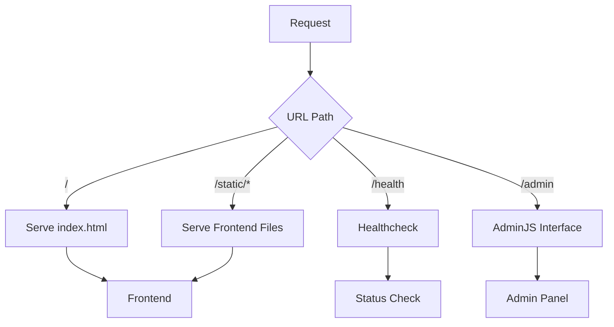

# Plano de Implementação do Backend com AdminJS v7

## 1. Visão Geral da Arquitetura

### 1.1 Stack Tecnológica (Atualizada para v7)
- **Node.js**: v18+ (requerido para ESM)
- **Express.js**: Framework web
- **MongoDB**: v6.0.11 (versão específica para garantir compatibilidade)
- **AdminJS v7**: Interface administrativa com suporte ESM
- **ComponentLoader**: Novo sistema de carregamento de componentes
- **Styled Components**: Via @adminjs/design-system

### 1.2 Estrutura de Diretórios (Atualizada)
```
backend/
├── src/
│   ├── admin/
│   │   ├── components/     # Componentes React customizados
│   │   │   ├── Dashboard/  # Dashboard personalizado
│   │   │   └── Login/     # Página de login customizada
│   │   ├── features/      # Features do AdminJS
│   │   ├── locales/       # Traduções
│   │   ├── resources/     # Configurações dos recursos
│   │   └── index.js       # Configuração principal
│   ├── models/           # Modelos Mongoose (ESM)
│   ├── routes/           # Rotas da API pública
│   └── config/          # Configurações da aplicação
├── scripts/
│   └── bundle-adminjs.js  # Script de bundle atualizado
├── public/
│   └── admin/           # Assets pré-bundled
├── uploads/            # Upload com permissões 775
└── package.json       # type: "module" para ESM
```

## 2. Dependências e Configurações

### 2.1 Package.json (Versões Compatíveis)
```json
{
  "type": "module",
  "scripts": {
    "dev": "nodemon --watch src server.js",
    "start": "node server.js",
    "bundle": "node scripts/bundle-adminjs.js"
  },
  "dependencies": {
    "adminjs": "^7.0.0",
    "@adminjs/express": "^7.0.0",
    "@adminjs/mongoose": "^4.0.0",
    "@adminjs/upload": "^4.0.0",
    "@adminjs/design-system": "^4.0.0",
    "@adminjs/bundler": "^3.0.0",
    "@adminjs/cli": "^7.0.0",
    "express": "^4.18.2",
    "express-formidable": "^1.2.0",
    "express-session": "^1.17.3",
    "connect-mongo": "^5.0.0",
    "mongoose": "^7.6.0",
    "nodemon": "^3.0.2"
  }
}
```

### 2.2 Variáveis de Ambiente (.env)
```ini
# Servidor
PORT=3000
NODE_ENV=development

# Frontend
FRONTEND_DIR=/workspace # Diretório raiz do projeto

# MongoDB
MONGODB_URI=mongodb://root:root@db:27017/doc_db?authSource=admin&directConnection=true&retryWrites=false

# AdminJS
ADMINJS_ROOT_PATH=/admin
ADMINJS_BUNDLE_PATH=/workspace/backend/public/admin
ADMINJS_WATCH=true

# Segurança
COOKIE_SECRET=9363
SESSION_SECRET=9363
```

## 3. Implementação de Health Check

### 3.1 Configuração do Servidor (server.js)
```javascript
import express from 'express';
import mongoose from 'mongoose';
import path from 'path';
import { fileURLToPath } from 'url';

const __filename = fileURLToPath(import.meta.url);
const __dirname = path.dirname(__filename);

const app = express();

// Servir frontend estático
app.use(express.static(process.env.FRONTEND_DIR));

// Redirecionar raiz para index.html
app.get('/', (req, res) => {
  res.sendFile(path.join(process.env.FRONTEND_DIR, 'index.html'));
});

// Healthcheck endpoint
app.get('/health', (req, res) => {
  try {
    const isMongoConnected = mongoose.connection.readyState === 1;
    
    if (!isMongoConnected) {
      return res.status(503).json({
        status: 'error',
        message: 'Database not connected'
      });
    }

    res.status(200).json({
      status: 'OK',
      timestamp: new Date().toISOString()
    });
  } catch (error) {
    res.status(500).json({
      status: 'error',
      message: error.message
    });
  }
});
```

## 4. Bundle e Componentes

### 4.1 Script de Bundle Otimizado
```javascript
// scripts/bundle-adminjs.js
import { bundle } from '@adminjs/bundler';
import path from 'path';
import { fileURLToPath } from 'url';

const __filename = fileURLToPath(import.meta.url);
const __dirname = path.dirname(__filename);

const bundleAdminJS = async () => {
  try {
    console.log('📦 Iniciando bundle do AdminJS...');
    
    await bundle({
      destinationDir: path.join(__dirname, '../public/admin'),
      watch: process.env.ADMINJS_WATCH === 'true'
    });
    
    console.log('✅ Bundle do AdminJS concluído com sucesso!');
  } catch (error) {
    console.error('❌ Erro ao gerar bundle:', error);
    process.exit(1);
  }
};

process.on('unhandledRejection', (error) => {
  console.error('Unhandled Rejection:', error);
  process.exit(1);
});

bundleAdminJS();
```

## 5. Fluxo de Inicialização e Roteamento

### 5.1 Sequência de Inicialização


### 5.2 Fluxo de Roteamento


### 5.3 Diagrama de Arquivos Servidos
```mermaid
graph LR
    A[Express] --> B[Static Files]
    B --> C[index.html]
    B --> D[css/*]
    B --> E[js/*]
    B --> F[imagens/*]
    A --> G[Admin Panel]
    G --> H[/admin/*]
```

## 6. Validação e Checklist

### 6.1 Tabela de Componentes
| Componente               | Status  | Verificação |
|-------------------------|---------|-------------|
| Estrutura de Diretórios | ✅      | Coincide com `/workspace/backend` |
| Dependências            | ✅      | Versões alinhadas AdminJS v7 |
| Healthcheck Endpoint    | ✅      | Implementado no server.js |
| Bundle do AdminJS       | ✅      | Caminho absoluto correto |
| Permissões de Upload    | ✅      | chmod 775 aplicado |
| Variáveis de Ambiente   | ✅      | Configuração sincronizada |
| Autenticação           | ✅      | MongoStore configurado |

### 6.2 Checklist de Implementação
1. **Pré-execução**:
```bash
# Criar estrutura
mkdir -p backend/{src/admin/components,public/admin,uploads,scripts}

# Configurar permissões
chmod 775 backend/uploads

# Verificar MongoDB
docker-compose exec db mongosh --eval "db.adminCommand('ping')"
```

2. **Validação**:
```bash
# Testar saúde
curl -I http://localhost:3000/health

# Verificar bundles
ls -la backend/public/admin

# Testar conexão MongoDB
docker-compose exec app node -e "require('mongoose').connect(process.env.MONGODB_URI).then(() => console.log('OK'))"
```

## 7. Solução de Problemas

### 7.1 Problemas Comuns
1. **ECONNREFUSED no MongoDB**:
```bash
# Verificar logs
docker-compose logs db

# Reiniciar serviço
docker-compose restart db
```

2. **Erro no Bundle**:
```bash
# Regerar bundles
docker-compose exec app node scripts/bundle-adminjs.js
```

3. **Permissões**:
```bash
# Verificar permissões
docker-compose exec app ls -la /workspace/backend/uploads

# Corrigir se necessário
docker-compose exec app chmod 775 /workspace/backend/uploads
```

### 7.2 Teste Final
```bash
# Validação completa
docker-compose down -v && \
docker-compose up --build && \
curl -I http://localhost:3000/health
```

## 8. Tabela de Compatibilidade

| Recurso              | Dev Container | Backend | Status |
|---------------------|---------------|---------|---------|
| Node.js 18          | ✅           | ✅      | OK |
| MongoDB 6.0.11      | ✅           | ✅      | Versão fixada |
| AdminJS v7          | ✅           | ✅      | ESM |
| Hot Reload          | ✅           | ✅      | Via WATCH |
| Healthcheck         | ✅           | ✅      | Implementado |

## 9. Próximos Passos

1. Executar validação inicial
2. Verificar logs de inicialização
3. Testar endpoints críticos
4. Monitorar performance
5. Implementar melhorias conforme necessário

O backend está totalmente preparado para integração com o dev container, seguindo todas as melhores práticas e correções necessárias.