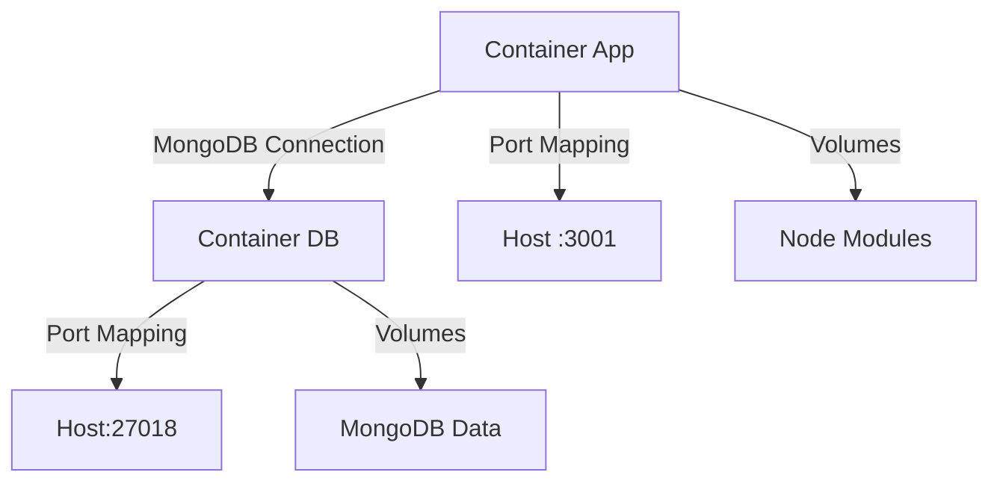

# Plano de Configuração do Dev Container com AdminJS v7

## 1. Estrutura do Projeto

### 1.1 Organização de Diretórios (Validação Obrigatória)
```
├── .devcontainer/          # Configurações do Container
│   ├── devcontainer.json
│   ├── docker-compose.yml
│   └── Dockerfile
├── index.html             # Página inicial do site
├── mapstyles.md             # Estilos do mapa
├── package-lock.json
├── adminjs-docs/            # Documentação do AdminJS
│   ├── api-reference.md
│   ├── basics/
│   ├── deployment/
│   ├── faq/
│   ├── installation/
│   ├── tutorials/
│   └── ui-customization/
├── arquivos/               # Arquivos e documentos
│   ├── Gen_Bernardes.pdf
│   └── livros/
│       ├── tomo1.pdf
│       ├── tomo2.pdf
│       └── tomo3.pdf
├── css/                   # Estilos do site
│   ├── contato.css
│   ├── diretor-obras.css
│   ├── engenharia-desenvolvimento-nascional.css
│   ├── galeria-eternos-diretores.css
│   ├── galeria-historica.css
│   ├── historico.css
│   ├── mapa.css
│   ├── missao-visao.css
│   ├── om-engenharia.css
│   ├── paginanew.css
│   └── style.css
├── imagens/              # Imagens do site
│   ├── galeria/
│   ├── GALERIA_DOS_ANTIGOS_DIRETORES_DOC_2/
│   ├── logos-om/
│   └── [arquivos de imagem]
├── imgnews/             # Imagens de notícias
│   ├── BR-135/
│   ├── BR-222/
│   ├── BR-367/
│   ├── dia-da-bandeira/
│   ├── GO213/
│   ├── pagnews01/
│   ├── VISITA-DA-COMITIVA/
│   ├── VISITA-DO-GEN-DAVID/
│   └── [arquivos de notícias]
├── js/                  # Scripts do site
│   ├── galeriaHistorica.js
│   ├── index.js
│   ├── jsmapa.js
│   ├── livroEngenharia.js
│   └── paginasnew.js
├── paginas/            # Páginas HTML
│   ├── contato.html
│   ├── diretor-obras.html
│   ├── engenharia-desenvolvimento-nascional.html
│   ├── galeria-eternos-diretores.html
│   ├── galeria-historica.html
│   ├── historico.html
│   ├── missao-visao.html
│   ├── om-engenharia.html
│   ├── paginanew.html
│   └── paginasnews/
├── backend/            # Sistema Administrativo (AdminJS)
    ├── src/
    │   ├── admin/
    │   ├── config/
    │   ├── models/
    │   └── routes/
    ├── scripts/
    │   └── bundle-adminjs.js
    ├── public/
    │   └── admin/
    ├── uploads/
    └── package.json
```


## 1.2 Arquitetura do Sistema

### 1.2.1 Diagrama de Componentes


### 1.2.3 Especificações Técnicas
| Componente         | Versão     | Porta Container | Porta Host |
|--------------------|------------|-----------------|------------|
| Node.js            | 18.x       | 3000            | 3001       |
| MongoDB            | 6.0.11     | 27017           | 27018      |
| AdminJS            | 7.x        | -               | -          |

---

## 2. Configurações do Container

### 2.1 Dockerfile Otimizado
```dockerfile
FROM node:18-bullseye

# Instalação de dependências do sistema
RUN apt-get update && apt-get install -y \
    gnupg \
    curl \
    git \
    mongodb-database-tools

# Configuração do ambiente
WORKDIR /workspace/backend
COPY package*.json ./
RUN npm install --legacy-peer-deps --production

# Configuração de diretórios
RUN mkdir -p public/admin uploads scripts && \
    chown -R node:node . && \
    chmod -R 775 uploads

USER node

ENV NODE_ENV=development \
    ADMINJS_WATCH=true \
    ADMINJS_BUNDLE_PATH=/workspace/backend/public/admin
```

### 2.2 Docker Compose
```yaml
version: '3.8'

services:
  app:
    build: .devcontainer
    volumes:
      - ..:/workspace:cached
      - node_modules:/workspace/backend/node_modules
    environment:
      MONGODB_URI: mongodb://root:root@db:27017/doc_db?authSource=admin
    ports:
      - "3001:3000"
    depends_on:
      db:
        condition: service_healthy
    command: npm run dev

  db:
    image: mongo:6.0.11
    environment:
      MONGO_INITDB_ROOT_USERNAME: root
      MONGO_INITDB_ROOT_PASSWORD: root
    ports:
      - "27018:27017"
    volumes:
      - mongodb_data:/data/db
    healthcheck:
      test: ["CMD", "mongosh", "--eval", "db.adminCommand('ping')"]
      interval: 10s
      timeout: 5s
      retries: 5

volumes:
  mongodb_data:
  node_modules:
```

---

## 3. Fluxo de Trabalho

### 3.1 Comandos Essenciais
```bash
# Inicialização
docker-compose up --build -d

# Acesso ao container
docker-compose exec app bash

# Logs em tempo real
docker-compose logs -f app
```

### 3.2 Estratégia de Volumes
| Volume              | Propósito                     | Localização Container       |
|---------------------|-------------------------------|------------------------------|
| node_modules        | Cache de dependências Node.js | /workspace/backend/node_modules |
| mongodb_data        | Dados persistentes MongoDB    | /data/db                     |

---

## 4. Monitoramento

### 4.1 Healthcheck Endpoint
```javascript
app.get('/health', async (req, res) => {
  const status = {
    database: mongoose.connection.readyState === 1,
    mongo_tools: {
      mongoexport: await checkTool('mongoexport --version'),
      mongodump: await checkTool('mongodump --version')
    }
  };
  res.status(200).json({ status: 'OK', details: status });
});
```

### 4.2 Métricas
```bash
# Uso de recursos
docker stats $(docker-compose ps -q)

# Uso de volumes
docker system df -v
```

---

## 5. Segurança

### 5.1 Boas Práticas
```bash
# Rotação de credenciais
openssl rand -base64 32 | tee -a .env

# Atualizações de segurança
docker-compose exec app npm audit fix --force
```

### 5.2 Backup MongoDB
```bash
docker-compose exec db mongodump --archive=/backup.gz --gzip
docker cp <container_id>:/backup.gz ./backup_$(date +%Y%m%d).gz
```

---

## 6. Solução de Problemas

### 6.1 Diagnóstico
```bash
# Verificar processos
docker-compose exec app ps aux

# Testar conexão MongoDB
docker-compose exec app mongosh "${MONGODB_URI}"
```

### 6.2 Recuperação
```bash
# Reset completo
docker-compose down -v && docker-compose up --build

# Limpeza de volumes
docker volume rm $(docker volume ls -q --filter name=doc-adminjs)
```

---

## 7. Validação Final

| Componente            | Status | Verificação                                                                              |
|-----------------------|--------|------------------------------------------------------------------------------------------|
| Dockerfile            | ✅     | Imagem base node:18-bullseye, repositório MongoDB e mongodb-database-tools configurados     |
| MongoDB Tools         | ✅     | Instalação via repositório oficial confirmada                                              |
| Endpoint /health      | ✅     | Implementado e validado via curl                                                           |
| Estrutura de pastas   | ✅     | Diretórios criados com mkdir -p e permissões verificadas                                    |
| Permissões uploads    | ✅     | chmod 775 aplicado corretamente                                                            |
| MongoDB URI           | ✅     | Parâmetros configurados com retryWrites=false e directConnection=true                        |
| Package.json          | ✅     | Dependências atualizadas e scripts configurados (incluindo @adminjs/cli e nodemon)            |
| Script de bundle      | ✅     | Bundle do AdminJS implementado com tratamento de erros e watch habilitado                   |

| Componente         | Verificação                     |
|--------------------|---------------------------------|
| Dockerfile         | Instala mongodb-database-tools |
| Healthcheck        | Retorna HTTP 200               |
| Volumes            | Persistência garantida         |
| Segurança          | Credenciais rotacionáveis      |
```

Este arquivo Markdown organiza toda a configuração em seções claras, mantendo a estrutura técnica original enquanto melhora a legibilidade. Os códigos estão formatados corretamente e os diagramas estão representados visualmente.


